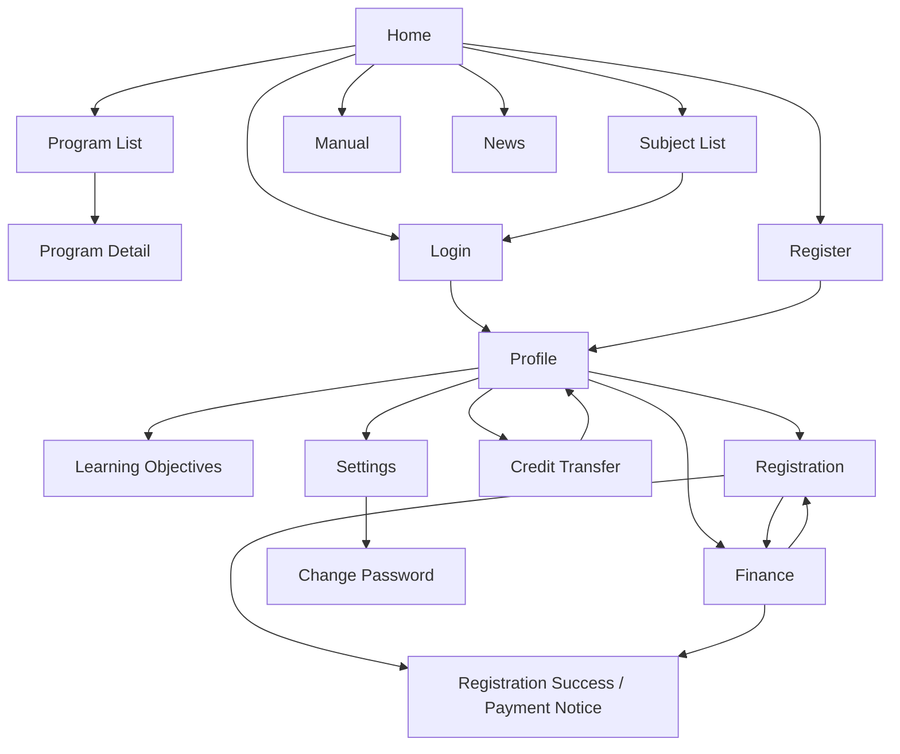

# Current Flow Map

## Scope

This document maps the current observed website flows before redesign. It is based on read-only inspection of the existing website on 2026-07-18 Asia/Bangkok.

## Flow Overview

## Flow 1: Public Discovery

### Current Path

1. User enters Home.
2. User browses Programs, Subjects, About, Manual, or News.
3. User may open Program Detail.
4. User is prompted toward Login/Register or general CTA.

### Pages

- `/index.html`
- `/program.html`
- `/program_detail.html?id=0`
- `/subject.html`
- `/about-us.html`
- `/manual.html`
- `/news.html`
- `/news-detail.html`

### Current Friction

- Public pages show logged-in controls, which weakens state clarity.
- Public discovery pages use broad CTA sections but the primary desired action is not always clear.
- News detail contains unrelated provident-fund content.
- Program and subject discovery relationship is unclear.

### Redesign Direction

- Separate anonymous/public and logged-in navigation states.
- Make "Browse programs", "Browse subjects", "Register", and "Login" roles explicit.
- Make program/subject details decision-oriented: overview, requirements, credits, price/payment, registration eligibility, next action.

## Flow 2: Authentication and Onboarding

### Current Path

1. User opens Login or Register.
2. Login accepts email/national ID and password, plus Google login.
3. Register collects basic personal/contact/password information and terms acceptance.
4. User likely proceeds to Profile after authentication.

### Pages

- `/login.html`
- `/register.html`
- `/register-thank-you.html` pending verification
- `/profile.html`

### Current Friction

- Login page has no observed H1.
- Login/register pages show logged-in user controls.
- Security and validation states are not yet visible.
- Registration completion, verification, and next step are unclear.

### Redesign Direction

- Clarify account state and entry path.
- Provide clear post-register next step.
- Define validation, error, verification, and success states.
- Keep identity/profile completion separate from account creation where appropriate.

## Flow 3: Learning and Registration

### Current Path

1. User browses or enters member area.
2. User views Learning Objectives.
3. User views Registration.
4. Registration page shows personal information, registered subjects, financial information, and learning summary.
5. User may proceed to payment notice after registration.

### Pages

- `/learning-objectives.html`
- `/registration.html`
- `/checkout-subject-success.html`
- `/finance.html`

### Current Friction

- Learning objectives, registration, and finance overlap.
- Registration includes profile and finance content that may distract from the main task.
- It is unclear whether registration is a historical record, current cart, learning dashboard, or active enrollment flow.

### Redesign Direction

- Define separate user intents:
  - Plan learning
  - Register for a subject/program
  - Track enrolled subjects
  - Pay outstanding amount
  - View learning progress
- Keep each page focused on one primary task.

## Flow 4: Finance and Payment

### Current Path

1. User opens Finance.
2. User sees personal information.
3. User sees registered subjects.
4. User sees financial summary.
5. User views receipts/invoices.
6. User can open payment notice page.

### Pages

- `/finance.html`
- `/checkout-subject-success.html`

### Current Friction

- Finance page title says Profile while H1 says Finance.
- Finance contains editable personal profile information.
- Payment status and next action are not visually dominant enough.
- Receipts, invoices, payment notice, and registration summary appear to belong to one combined flow but are not clearly sequenced.

### Redesign Direction

- Make finance a task-focused payment dashboard:
  - Outstanding amount
  - Due items
  - Payment instructions
  - Payment notification
  - Payment history
  - Receipts/invoices
- Separate profile editing from finance.
- Define payment states: unpaid, pending verification, paid, rejected, refunded/cancelled if relevant.

## Flow 5: Credit Transfer

### Current Path

1. User opens Credit Transfer.
2. User chooses transfer in or transfer out.
3. User fills a form.
4. User uploads or selects evidence.
5. User submits and sees email preview.
6. User can view request history.

### Pages

- `/credit-transfer.html`

### Current Friction

- Transfer in and transfer out are both present on one page.
- The task has many decision points but no clear stepper.
- Evidence/document requirements are not prominent enough.
- Email preview may feel like an internal/admin artifact rather than user confirmation.

### Redesign Direction

- Split the flow into:
  - Select transfer type
  - Enter request details
  - Add evidence
  - Review request
  - Submit
  - Track status
- Use explicit status badges and request timeline.

## Flow 6: Account and Settings

### Current Path

1. User opens Profile.
2. User may update personal/education details.
3. User opens Change Password or Settings.
4. User saves preferences or password updates.

### Pages

- `/profile.html`
- `/change-password.html`
- `/setting.html`

### Current Friction

- Change Password and Settings page titles reference a provident fund.
- Profile fields have missing labels/names in the observed DOM.
- Settings include notification/privacy/export options that need requirement confirmation.

### Redesign Direction

- Separate profile identity, account security, and preferences.
- Keep settings only if each setting has real system behavior.
- Ensure sensitive actions have clear confirmation and validation states.

## Cross-Flow Dependencies

| Dependency | Why It Matters |
|---|---|
| Authentication -> Profile | User identity and profile completeness affect registration, payment, and credit transfer. |
| Program/Subject Discovery -> Registration | Users need enough information before registering. |
| Registration -> Finance | Registered items create payment obligations. |
| Finance -> Payment Notice | Payment flow depends on outstanding balance and selected items. |
| Learning Objectives -> Program/Subject Discovery | Recommendations should connect to concrete programs/subjects. |
| Credit Transfer -> Learning Record | Approved transfers likely affect progress, credits, and registration eligibility. |

## Open Questions

- Is this website a static prototype, production website, or old implementation?
- Which user roles exist beyond students/members?
- Is staff/admin workflow included in this redesign?
- What is the source of truth for program, subject, price, credit, and payment data?
- What payment verification workflow happens after a user submits transfer proof?
- What should credit transfer status values be?

