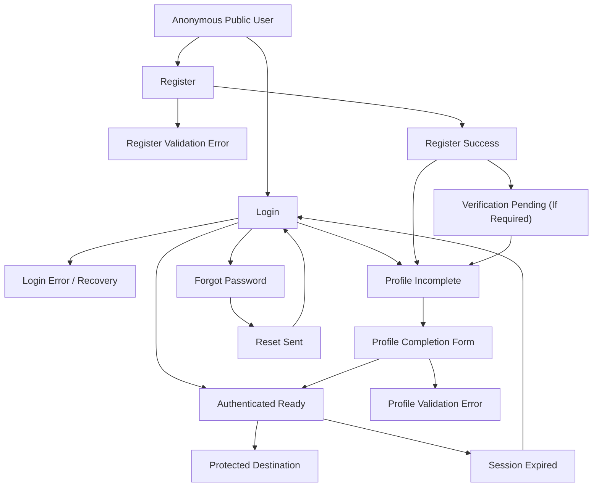

# Future Auth and Onboarding Flow

## Purpose

This document translates the auth/onboarding state model into a redesign-ready future flow.

It defines:

- the intended journey for new and returning users
- the screen sequence
- the state-driven decision points
- the required UI outputs for design

## Flow Goal

Help users:

- sign in with confidence
- create an account without confusion
- complete required profile setup before protected academic or transactional actions
- recover gracefully from validation, credential, or session problems

## Primary User Types

- New learner creating an account
- Returning learner signing in
- Signed-in learner who still needs profile completion
- Signed-in learner resuming after session expiry

## Future Journey Overview

## Recommended Screen Sequence

### 1. Login

Purpose:

- Sign in returning users
- Accept redirect from protected routes
- Provide clear path to register or recover password

Primary content:

- Page heading
- Short trust/support description
- Email or national-ID input
- Password input
- Remember me
- Sign in CTA
- Google sign-in option
- Register link
- Forgot password link

Primary next actions:

- Sign in
- Create account
- Reset password

### 2. Register

Purpose:

- Create a new account with only the fields needed to start onboarding

Primary content:

- First name
- Last name
- Phone
- Email
- Password
- Confirm password
- Consent checkbox
- Register CTA
- Back to login link

Primary next actions:

- Create account
- Return to sign in

### 3. Register Success

Purpose:

- Confirm account creation
- Explain exactly what happens next

Possible outcomes:

- Continue to verification pending
- Continue directly to profile completion

Primary content:

- Success confirmation
- What was created
- What happens next
- Continue CTA

### 4. Verification Pending

Purpose:

- Handle email or account verification if required by business rules

Primary content:

- Verification instruction
- Support note
- Resend action if supported
- Back to sign in

### 5. Forgot Password

Purpose:

- Let users request password reset without leaving the auth journey

Primary content:

- Email field
- Reset CTA
- Return to sign in

### 6. Reset Sent

Purpose:

- Confirm that the recovery request was accepted

Primary content:

- Confirmation panel
- Where to look next
- Back to sign in CTA

### 7. Profile Completion

Purpose:

- Collect the minimum required data before a user can register, pay, or submit credit transfer requests

Primary content groups:

- Personal details
- Education details
- Education history if required
- Missing-requirements checklist
- Save and continue CTA

Primary next actions:

- Save required details
- Continue to account/dashboard

### 8. Authenticated Ready

Purpose:

- Route user into the most relevant next destination

Possible destinations:

- Member dashboard
- Registration
- Finance
- Intended protected page

## Decision Rules

### Returning User Signs In Successfully

- If required profile data is complete: route to intended destination or member dashboard
- If required profile data is incomplete: route to profile completion

### New User Registers Successfully

- If verification is required: route to verification pending
- If verification is not required: route to profile completion

### User Hits A Protected Page Without Auth

- Redirect to login
- Preserve intended destination for post-login routing

### Session Expires Mid-Journey

- Route to login
- Explain expiry
- Restore intended destination if safe

## Required Screen States

### Login

- Default
- Field validation error
- Credential failure
- Loading
- Session-expired entry

### Register

- Default
- Field validation error
- Consent missing
- Password mismatch
- Loading

### Register Success

- Verification required
- Continue to profile completion

### Forgot Password

- Default
- Validation error
- Confirmation sent

### Profile Completion

- Default
- Incomplete checklist
- Field validation error
- Saving
- Saved successfully

## Gating Rules

- Anonymous users may browse public content only.
- Authenticated but incomplete users may access profile completion and limited account surfaces only.
- Only `authenticated_ready` users may complete registration, payment submission, or credit transfer submission.

## Required Components

- Public/auth header variants
- Focused auth page header
- Form fields with inline validation
- Password rules and visibility toggle
- Consent component
- Status panel
- Success panel
- Support/help panel
- Profile completion checklist

## Design Notes

- Login and register should feel related but clearly separate.
- Register success should be its own moment, not an instant redirect.
- Profile completion should feel like onboarding, not like generic account settings.
- The journey should reduce ambiguity at every transition.

## Open Questions

- Is verification required in v1?
- Which profile fields are truly required before registration?
- Does profile completion support draft save?
- What is the preferred post-login destination when no intended route exists?

