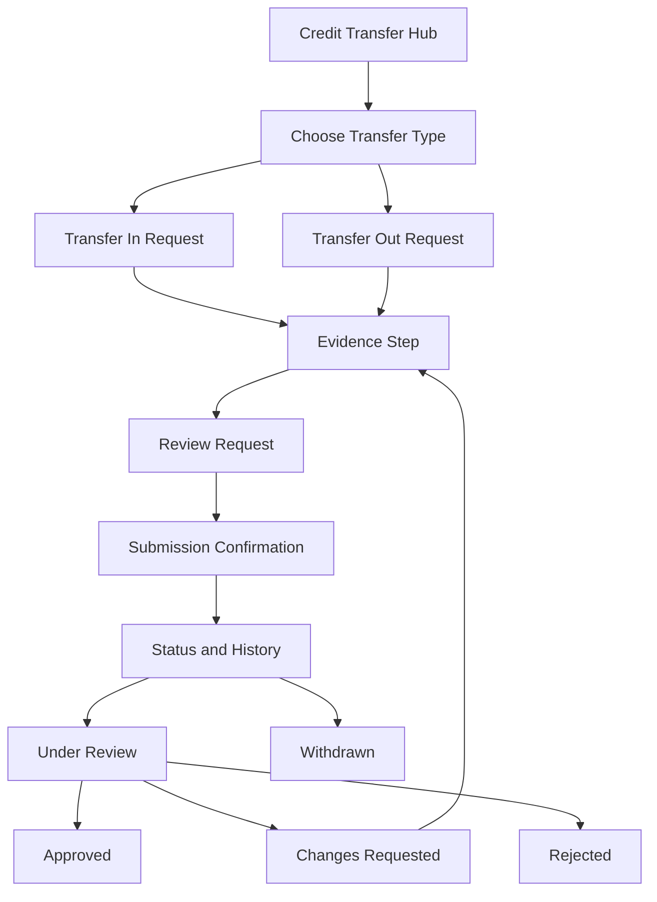

# Future Credit Transfer Flow

## Purpose

This document translates the credit transfer state model into a redesign-ready future flow.

It defines:

- the intended user journey
- the screen sequence
- the decision points between transfer types and statuses
- the required UI outputs for design

## Flow Goal

Help members:

- understand whether they need transfer in or transfer out
- submit the correct request with the right evidence
- review before final submission
- track review status without confusion
- correct issues when staff requests changes

## Primary User Types

- Member bringing prior learning into CREDIT BANK
- Member exporting completed CREDIT BANK learning to another institution
- Member checking status on a submitted request
- Member responding to staff-requested corrections

## Future Journey Overview

## Recommended Screen Sequence

### 1. Credit Transfer Hub

Purpose:

- Introduce the credit transfer feature
- Explain the difference between transfer in and transfer out
- Provide request history preview

Primary content:

- Short overview
- Transfer type cards
- Eligibility/help summary
- Request history preview

Primary next actions:

- Start transfer in
- Start transfer out
- View all request history

### 2. Transfer Type Selection

Purpose:

- Confirm the user's chosen path before entering the detailed request flow

Primary content:

- Transfer-in card
- Transfer-out card
- Short explanation of each path
- Requirements summary

Primary next actions:

- Continue with transfer in
- Continue with transfer out

### 3. Credit Transfer Request

Purpose:

- Collect the core details for the selected transfer type

Transfer-in content:

- Source institution
- Subject/course or learning item
- Request detail

Transfer-out content:

- Completed subjects selection
- Destination institution
- Destination type
- Additional destination detail

Primary next actions:

- Continue to evidence
- Save draft if supported

### 4. Evidence Step

Purpose:

- Collect and validate supporting documents before review

Primary content:

- Evidence checklist
- File upload
- Missing evidence warnings
- Rules for accepted document types

Primary next actions:

- Continue to review
- Replace or add evidence

### 5. Review Request

Purpose:

- Let the member confirm details and evidence before final submission

Primary content:

- Request summary
- Evidence summary
- Transfer type summary
- Edit links back to prior steps

Primary next actions:

- Submit request
- Edit request

### 6. Submission Confirmation

Purpose:

- Confirm successful submission and explain what happens next

Primary content:

- Request ID
- Submitted date/time
- Transfer type
- Next-step guidance

Primary next actions:

- View status and history
- Return to hub

### 7. Status and History

Purpose:

- Show all submitted requests and the current lifecycle stage of each one

Primary content:

- Request list/table
- Current status badges
- Timeline or detail drill-down
- Request metadata

Primary next actions:

- View request details
- Continue requested corrections if applicable
- Start a new request

### 8. Under Review

Purpose:

- Reassure the member that the request is being processed

Primary content:

- Under-review status panel
- Submitted evidence summary
- Expected next-step guidance
- Contact/support path if needed

Primary next actions:

- Return to history
- Contact support if necessary

### 9. Changes Requested

Purpose:

- Explain exactly what needs correction and route the member back into the flow

Primary content:

- Requested changes summary
- Reviewer note or reason
- Highlighted fields/evidence to update

Primary next actions:

- Continue correction
- Resubmit

### 10. Approved / Rejected / Withdrawn

Purpose:

- Communicate final outcome clearly

Approved content:

- Approved status
- Effective result summary
- Any next academic or administrative implication

Rejected content:

- Rejected status
- Final reason
- Support path if re-application is possible

Withdrawn content:

- Withdrawn status
- What this means for the request lifecycle

## State Mapping To Screens

| Transfer State | Primary Screen | Supporting Screen |
|---|---|---|
| `not-started` | Credit Transfer Hub | Transfer Type Selection |
| `draft-started` | Credit Transfer Request | Evidence Step |
| `evidence-incomplete` | Evidence Step | Credit Transfer Request |
| `ready-for-review` | Review Request | Evidence Step |
| `submitted` | Submission Confirmation | Status and History |
| `under-review` | Under Review | Status and History |
| `changes-requested` | Changes Requested | Evidence Step |
| `approved` | Status and History | Approved detail |
| `rejected` | Status and History | Rejected detail |
| `withdrawn` | Status and History | Withdrawn detail |

## Required Screen States

### Hub

- First visit
- Existing history available
- No prior requests

### Request Form

- Transfer in
- Transfer out
- Draft in progress
- Validation errors

### Evidence

- Complete
- Missing required files
- Invalid upload
- Upload success/failure

### Review

- Ready to submit
- Incomplete blocking issues

### Status

- Submitted
- Under review
- Changes requested
- Approved
- Rejected
- Withdrawn

## Required Components

- Transfer type cards
- Page header
- Stepper
- Form fields
- Form sections
- Evidence checklist
- File upload
- Status badge
- Status panel
- Request history table
- Confirmation panel

## Design Notes

- Do not show both transfer-in and transfer-out long forms on the same screen.
- The request type decision should happen before heavy form entry.
- Evidence requirements must be obvious before the user reaches review.
- Email preview should not be the primary confirmation surface.

## Open Questions

- Can members save drafts?
- Can members withdraw a request after submission?
- What exact evidence types are required for transfer out?
- What happens in the system after approval: credits posted, downloadable package, or external notification?

