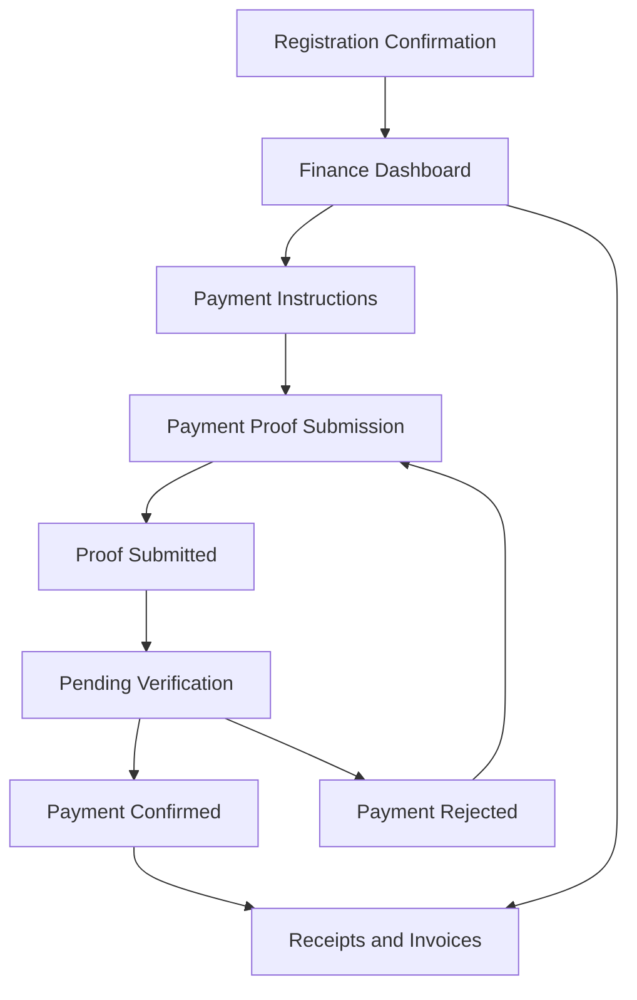

# Future Finance and Payment Flow

## Purpose

This document translates the payment state model into a redesign-ready future flow.

It defines:

- the intended member payment journey
- the screen sequence
- state-driven transitions
- the UI requirements needed before high-fidelity design starts

## Flow Goal

Help members:

- understand what they owe
- know what to do next
- submit payment proof confidently
- track verification without duplicate action
- access receipts and invoices at the correct time

## Primary User Types

- Member with newly created payable item
- Member with unpaid registration
- Member who has submitted payment proof
- Member waiting for verification
- Member whose payment was confirmed or rejected

## Future Journey Overview

## Recommended Screen Sequence

### 1. Registration Confirmation

Purpose:

- Confirm what the user registered for
- Explain whether payment is required
- Route the user into finance if payment is needed

Primary content:

- Registered item summary
- Total payable amount if any
- Next action CTA

Primary next actions:

- Go to finance dashboard
- Return to registrations

### 2. Finance Dashboard

Purpose:

- Act as the primary transactional hub for all payment-related activity

Primary content:

- Outstanding balance summary
- Payable item list
- Payment status panel
- Next required action
- Recent payment activity
- Secondary links to receipts/invoices

Primary next actions:

- View payment instructions
- Submit payment proof
- View payment history

### 3. Payment Instructions

Purpose:

- Present the payment method and exact instructions clearly

Primary content:

- Payment method
- Bank/account details
- Amount to pay
- Reference or guidance notes
- What proof to prepare

Primary next actions:

- Continue to payment proof submission
- Return to finance dashboard

### 4. Payment Proof Submission

Purpose:

- Collect payment proof and any required metadata

Primary content:

- Upload field
- Required proof checklist
- Amount paid
- Date/time paid if needed
- Additional notes if needed
- Validation rules

Primary next actions:

- Submit proof
- Save draft if supported
- Return to finance dashboard

### 5. Proof Submitted

Purpose:

- Confirm successful submission before review begins

Primary content:

- Success confirmation
- Submitted amount
- Submitted timestamp
- Proof filename or preview
- What happens next

Primary next actions:

- View payment status
- Return to finance dashboard

### 6. Pending Verification

Purpose:

- Show that the proof is in review and prevent duplicate submissions

Primary content:

- Pending badge/status panel
- Guidance not to resubmit
- Expected wait or support path
- Read-only submitted proof summary

Primary next actions:

- Return to finance dashboard
- Contact support if needed

### 7. Payment Confirmed

Purpose:

- Confirm success and unlock records/documents

Primary content:

- Confirmed status
- Paid amount
- Confirmation date
- Related registration context
- Receipt/invoice actions

Primary next actions:

- Download receipt
- Download invoice
- Return to registrations or dashboard

### 8. Payment Rejected

Purpose:

- Explain what was wrong and route user into correction

Primary content:

- Action required status
- Rejection reason
- Correction guidance
- Previous submission summary

Primary next actions:

- Submit corrected proof
- Contact support

### 9. Receipts and Invoices

Purpose:

- Provide structured archive access to official financial documents

Primary content:

- Transaction history
- Receipt list
- Invoice list
- Download actions

Primary next actions:

- View/download documents
- Return to finance dashboard

## State Mapping To Screens

| Payment State | Primary Screen | Supporting Screen |
|---|---|---|
| `no-payable-items` | Finance Dashboard | Receipts and Invoices |
| `payment-required` | Finance Dashboard | Payment Instructions |
| `notice-draft` | Payment Proof Submission | Finance Dashboard |
| `notice-submitted` | Proof Submitted | Finance Dashboard |
| `pending-verification` | Pending Verification | Finance Dashboard |
| `payment-confirmed` | Payment Confirmed | Receipts and Invoices |
| `payment-rejected` | Payment Rejected | Payment Proof Submission |
| `payment-cancelled` | Finance Dashboard | Registrations |
| `payment-refunded` | Receipts and Invoices | Finance Dashboard |

## Required Screen States

### Finance Dashboard

- No payable items
- Payment required
- Pending verification
- Payment confirmed
- Payment rejected
- Cancelled
- Refunded

### Payment Proof Submission

- Default
- Validation error
- Draft in progress if supported
- Upload success
- Upload failure
- Submit loading

### Payment Status Screens

- Submitted
- Pending verification
- Confirmed
- Rejected

### Receipts and Invoices

- Empty
- Available documents
- Download in progress if needed

## Required Components

- Outstanding balance summary
- Payable item row/card
- Status badge
- Status panel
- File upload
- CTA bar
- Confirmation panel
- Transaction table
- Action menu
- Empty state

## Design Notes

- Finance dashboard should always answer: what is my current state, what do I do next, what can I access now?
- Payment proof should be a dedicated task page, not buried inside a mixed summary screen.
- Receipts and invoices should support the flow, not dominate the first screen.
- Rejected payment state needs unusually strong clarity and reassurance.

## Open Questions

- What exact proof fields are mandatory besides the uploaded file?
- Are receipts available only after confirmation or also earlier?
- Are invoices available before payment confirmation?
- Can one user have multiple simultaneous payable items with different states in v1?
- Is draft saving required for payment proof submission?

