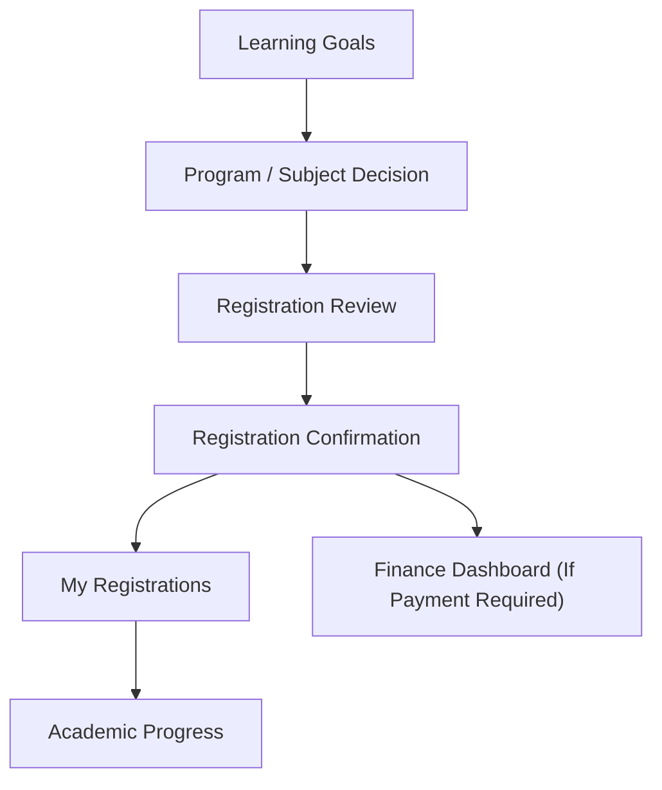

# Future Learning and Registration Flow

## Purpose

This document translates the current learning/registration overlap into a redesign-ready future flow.

It defines:

- the intended member journey from planning to enrollment tracking
- the screen sequence
- the main decision points between planning, registering, and tracking progress
- the required UI outputs for design

## Flow Goal

Help members:

- understand learning options and goals
- review what they are about to register for
- track active registrations separately from academic progress
- move cleanly into finance only when payment is required

## Primary User Types

- Member exploring recommended learning paths
- Member reviewing selected subjects/programs before registration
- Member checking active registrations
- Member checking historical academic progress

## Future Journey Overview

## Recommended Screen Sequence

### 1. Learning Goals

Purpose:

- Help the member define goals and see recommended learning directions

Primary content:

- Goal summary
- Recommended programs
- Recommended subjects
- Progress-by-category snapshot
- Career/outcome framing if retained

Primary next actions:

- View program
- View subject
- Start registration path

### 2. Program / Subject Decision

Purpose:

- Help the member evaluate a program or subject before committing

Primary content:

- Item summary
- Credits
- Eligibility
- Outcome/relevance
- Related items
- Registration CTA

Primary next actions:

- Register
- Save for later
- Return to recommendations

### 3. Registration Review

Purpose:

- Confirm exactly what the member is about to register for

Primary content:

- Selected program/subject summary
- Credits summary
- Requirements or warnings
- Cost/payment summary if applicable

Primary next actions:

- Confirm registration
- Edit selection

### 4. Registration Confirmation

Purpose:

- Confirm that registration was created successfully
- Route the member to the next relevant path

Possible next paths:

- My Registrations
- Finance dashboard if payment is required

Primary content:

- Confirmation message
- Registered item summary
- Next-step explanation

### 5. My Registrations

Purpose:

- Show current and recent registered items with clear status

Primary content:

- Active registration list
- Registration status badges
- Important next actions
- Link to finance if a payable item exists

Primary next actions:

- View registration detail
- Go to finance
- Return to learning goals

### 6. Academic Progress

Purpose:

- Show completed items, grades, earned credits, and completion history

Primary content:

- Progress summary
- Historical records
- Completion status
- Earned credits

Primary next actions:

- View detailed record
- Return to registrations

## Decision Rules

### Member Is Still Exploring

- Route to Learning Goals or discovery surfaces
- Do not overload with transactional detail too early

### Member Chooses A Program Or Subject

- Show decision support first
- Only then route into Registration Review

### Registration Is Completed

- If no payment is required: route to My Registrations
- If payment is required: route to Registration Confirmation, then Finance Dashboard

### Member Wants History, Not Action

- Route to Academic Progress rather than My Registrations

## Required Screen States

### Learning Goals

- Default
- No recommendations
- Partial progress available

### Registration Review

- Default
- Missing eligibility requirement if applicable
- Payment required summary

### Registration Confirmation

- Payment required
- No payment required

### My Registrations

- Active registrations available
- No active registrations
- Registration with outstanding payment

### Academic Progress

- Historical records available
- No historical records

## Required Components

- Page header
- Summary cards
- Program/subject item cards
- Registration review summary
- Status badges
- Data table
- CTA bar
- Empty state

## Design Notes

- Separate planning from commitment.
- Separate active registrations from historical academic progress.
- Registration should feel like a clear checkpoint, not a mixed dashboard.
- Finance should enter only when payment is relevant.

## Open Questions

- Can users register for both program-level and subject-level items in the same flow?
- Which statuses should appear in My Registrations beyond active/completed?
- Should Learning Goals remain personalized in v1 or be simplified into a recommendation surface?
- What parts of academic progress need certificate/document actions?

