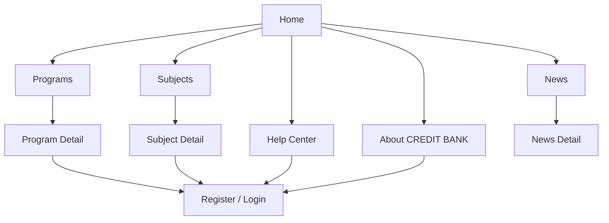

# Future Public Discovery Flow

## Purpose

This document translates the current public website structure into a redesign-ready future flow.

It defines:

- how new visitors should understand CREDIT BANK
- how users should move between home, programs, subjects, and help
- where sign-in and registration should appear in the journey
- the required UI outputs for design

## Flow Goal

Help visitors:

- understand what CREDIT BANK is
- browse programs and subjects with confidence
- evaluate whether an offering is relevant
- know when to sign in or create an account

## Primary User Types

- First-time visitor learning what CREDIT BANK is
- Prospect browsing programs
- Prospect browsing subjects directly
- Returning visitor who is ready to register or sign in

## Future Journey Overview

## Recommended Screen Sequence

### 1. Home

Purpose:

- Introduce CREDIT BANK clearly and route visitors to the right next journey

Primary content:

- What CREDIT BANK is
- Core value proposition
- Featured programs or subjects
- Main decision CTAs
- Institutional trust content

Primary next actions:

- Browse programs
- Browse subjects
- Sign in
- Create account

### 2. Programs

Purpose:

- Help visitors browse all programs with strong decision support

Primary content:

- Search/filter
- Program cards
- Key metadata for comparison

Primary next actions:

- View program detail
- Register or sign in when ready

### 3. Program Detail

Purpose:

- Help visitors evaluate one program before taking action

Primary content:

- Program overview
- Credits
- Requirements
- Outcomes
- Related subjects
- Primary next action

Primary next actions:

- Register
- Sign in
- Browse related subjects

### 4. Subjects

Purpose:

- Help visitors browse individual subjects separately from program browsing

Primary content:

- Search/filter
- Subject cards or list rows
- Key subject metadata

Primary next actions:

- View subject detail
- Register or sign in when ready

### 5. Subject Detail

Purpose:

- Help visitors understand one subject in enough detail to decide what to do next

Primary content:

- Subject overview
- Credits
- Eligibility
- Related program context
- Primary next action

Primary next actions:

- Register
- Sign in
- View related program

### 6. Help Center

Purpose:

- Provide task-based help before and after account creation

Primary content:

- Registration help
- Payment help
- Status-check help
- Credit transfer help

Primary next actions:

- View help article
- Sign in
- Create account

### 7. About CREDIT BANK

Purpose:

- Build institutional trust and explain the purpose of the system

Primary content:

- Institutional context
- Why CREDIT BANK exists
- Trust and governance signals

Primary next actions:

- Browse offerings
- Sign in
- Create account

### 8. News and News Detail

Purpose:

- Surface relevant announcements without confusing the main conversion path

Primary content:

- Verified news list
- News detail
- Related updates

Primary next actions:

- Return to main browsing journey

## Decision Rules

### Visitor Is Still Learning

- Route to Home, About, or Help Center

### Visitor Knows They Want An Offering

- Route directly into Programs or Subjects

### Visitor Finds An Item They Want

- Route to Program Detail or Subject Detail before auth

### Visitor Is Ready To Commit

- Route to Register or Login with the item context preserved if possible

## Required Screen States

### Home

- Default
- Returning visitor

### Programs / Subjects

- Default
- Filtered results
- No results

### Program Detail / Subject Detail

- Eligible/ready to continue
- Need sign-in/register to continue

### Help Center

- Default
- Search results if supported
- No results

### News

- List available
- No news available

## Required Components

- Public header
- Hero/value proposition section
- Search/filter controls
- Program and subject cards
- Page header
- CTA bar
- Help/support panel
- Trust/institutional content sections
- Empty state

## Design Notes

- Public pages must never show member-only controls.
- Program and subject discovery should feel useful before sign-in, not blocked too early.
- Help Center should be task-oriented, not document-heavy.
- News should support trust, not distract from primary journeys.

## Open Questions

- How much detail should be available before sign-in?
- Should visitors be able to save items before account creation?
- Are programs or subjects the primary discovery entry in the intended product strategy?
- Which trust signals matter most to the real audience: university authority, outcomes, certificates, or transferability?

