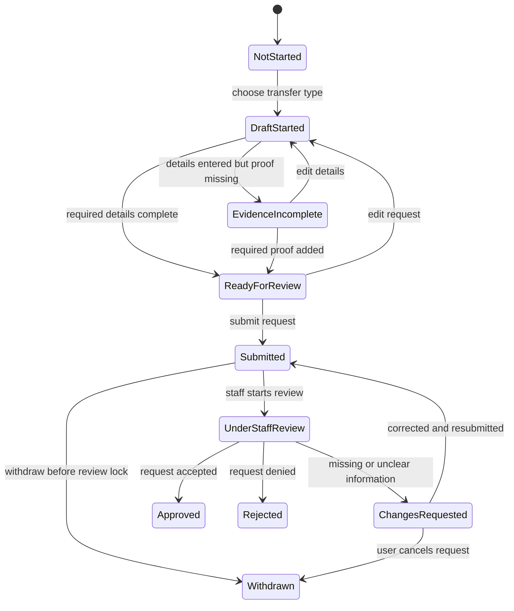

# CREDIT BANK Credit Transfer State Model

## Purpose

This document defines the proposed state model for the CREDIT BANK credit transfer flow based on the current repo audit. It translates the current single-page `credit-transfer.html` experience into a clearer, step-based model that can guide redesign, content, and future implementation.

## Source Context

This draft is based on:

- `docs/01-current-website-audit.md`
- `docs/02-current-page-inventory.md`
- `docs/03-current-flow-map.md`
- `docs/04-ux-ui-audit-findings.md`
- `docs/05-redesign-priority-backlog.md`

## Flow Scope

The current website combines these concerns on one page:

- Transfer type selection
- Transfer-in request entry
- Transfer-out request entry
- Evidence upload
- Email preview
- Request history

For redesign, the flow should be treated as one request lifecycle with two request variants:

- Transfer in: bring prior learning or credits into CREDIT BANK
- Transfer out: send completed CREDIT BANK learning or credits to another institution

## Core State Model

### State 0: Not Started

Definition:

- User has not started a credit transfer request.

Entry conditions:

- User opens credit transfer for the first time.
- User has no draft in progress.

Allowed actions:

- Choose transfer type
- Read eligibility/help content
- View past requests

Evidence requirement:

- None

Staff touchpoint:

- None

UI implications:

- Show transfer type cards, short eligibility summary, and request history preview.
- Do not show both long forms at once.

### State 1: Draft Started

Definition:

- User has chosen transfer type and started entering request information, but required fields are incomplete.

Entry conditions:

- User selects `transfer in` or `transfer out`.
- System creates a local or saved draft.

Allowed actions:

- Edit request details
- Switch transfer type before submission
- Save draft
- Cancel draft

Evidence requirement:

- Optional until request is ready for review

Staff touchpoint:

- None

UI implications:

- Use a stepper:
  - Type
  - Details
  - Evidence
  - Review
  - Submitted
- Show incomplete-field validation inline.

### State 2: Evidence Incomplete

Definition:

- Core request information is entered, but required supporting evidence is still missing or invalid.

Entry conditions:

- User completes details step without all required files or structured evidence.

Allowed actions:

- Upload files
- Replace files
- Return to edit details

Evidence requirement:

- Required before submission

Transfer-in minimum evidence:

- Source institution
- Subject/course name or equivalent learning item
- Supporting file upload
- Free-text request detail

Transfer-out minimum evidence:

- Selected completed subjects
- Destination institution
- Destination type
- Additional detail when required by destination

Evidence notes:

- Current audit only confirms one visible upload control on transfer-in.
- Transfer-out may also require exportable proof or generated documents, but this is not yet confirmed.

Staff touchpoint:

- None

UI implications:

- Show a checklist of required evidence by transfer type.
- Mark missing items as blocking.
- Avoid generic upload areas without document guidance.

### State 3: Ready For Review

Definition:

- Required details and evidence appear complete and the user can review before submission.

Entry conditions:

- System validates all required fields for the selected transfer type.

Allowed actions:

- Review summary
- Edit any previous step
- Submit request

Evidence requirement:

- All required items present

Staff touchpoint:

- None

UI implications:

- Replace the current email-preview-first behavior with a user-facing review summary.
- Email preview, if still needed, should be a hidden system artifact or an optional expandable staff-oriented section.

### State 4: Submitted

Definition:

- User has submitted the request and is waiting for staff intake or verification.

Entry conditions:

- User confirms and submits a valid request.

Allowed actions:

- View request detail
- Download submitted evidence list if supported
- Withdraw request if policy allows and staff has not yet begun review

Evidence requirement:

- Snapshot of submitted details and files becomes read-only record

Staff touchpoint:

- Intake confirmation
- Initial completeness check

UI implications:

- Show confirmation screen with request ID, submitted date, transfer type, and expected next step.
- Add request timeline instead of relying on email preview as primary confirmation.

### State 5: Under Staff Review

Definition:

- Staff has accepted the request into review and is checking details, evidence, and policy fit.

Entry conditions:

- Staff opens the submitted request and marks review as started.

Allowed actions:

- User views read-only status
- User may add clarification only if requested by staff

Evidence requirement:

- Existing evidence under review

Staff touchpoint:

- Verify eligibility
- Verify source/destination information
- Verify subject mapping or destination package
- Record reviewer notes

UI implications:

- Show a clear badge such as `Under review`.
- Show that the request is locked unless staff requests changes.

### State 6: Changes Requested

Definition:

- Staff found missing, unclear, or invalid information and returned the request to the user for correction.

Entry conditions:

- Staff rejects completeness or requires clarification without final denial.

Allowed actions:

- Edit only the requested fields
- Upload replacement evidence
- Resubmit

Evidence requirement:

- Only requested missing or corrected evidence

Staff touchpoint:

- Reviewer sends reason and requested action
- Reviewer rechecks the corrected submission

UI implications:

- Show exact missing items and reviewer comments.
- Do not force the user to restart the full request.

### State 7: Approved

Definition:

- Staff has approved the credit transfer request.

Entry conditions:

- Staff confirms the request meets academic and administrative requirements.

Allowed actions:

- User views decision details
- User downloads confirmation if supported

Evidence requirement:

- Final reviewed record retained

Staff touchpoint:

- Final approval
- Downstream academic record or export action if needed

UI implications:

- Show approval date, approved scope, and downstream outcome.
- Tell the user what changes next in their record.

### State 8: Rejected

Definition:

- Staff has denied the request and it will not proceed in its current form.

Entry conditions:

- Staff determines the request is ineligible, unsupported, or invalid.

Allowed actions:

- User views rejection reason
- User starts a new request if policy allows

Evidence requirement:

- Final reviewed record retained

Staff touchpoint:

- Final rejection reason
- Optional policy reference

UI implications:

- Use a clear but calm rejection state.
- Distinguish `rejected` from `changes requested`.

### State 9: Withdrawn

Definition:

- User or staff closes the request before final decision.

Entry conditions:

- User withdraws before review completion
- Staff cancels duplicate or invalid administrative submission

Allowed actions:

- View withdrawn request history
- Start a new request

Evidence requirement:

- Existing record retained for audit history

Staff touchpoint:

- Optional acknowledgement

UI implications:

- Keep withdrawn requests in history with a distinct badge.

## Transition Model

## Evidence Matrix

| State | Transfer In Evidence | Transfer Out Evidence | Blocking Rule |
|---|---|---|---|
| Not Started | None | None | No request yet |
| Draft Started | Optional early upload | Optional early selection/detail | User may continue drafting |
| Evidence Incomplete | Source institution, subject/course, detail, supporting file still missing in part | Completed subject selection, destination institution/type, or required detail still missing in part | Submission blocked |
| Ready For Review | Required set complete | Required set complete | Submission allowed |
| Submitted | Snapshot only | Snapshot only | User cannot silently mutate record |
| Under Staff Review | Reviewed evidence | Reviewed evidence | User waits unless asked to revise |
| Changes Requested | Requested replacement or clarification | Requested replacement or clarification | Resubmission blocked until addressed |
| Approved | Final archive | Final archive | Complete |
| Rejected | Final archive | Final archive | Closed |
| Withdrawn | Final archive | Final archive | Closed |

## Staff Verification Touchpoints

### Touchpoint A: Intake Check

When:

- Immediately after `Submitted`

Staff verifies:

- Request type is correct
- Required fields are present
- Files can be opened
- Duplicate submission risk

Possible outcome:

- Move to `Under Staff Review`
- Move to `Changes Requested`

### Touchpoint B: Academic or Policy Review

When:

- During `Under Staff Review`

Staff verifies:

- Eligibility of source or destination institution
- Subject equivalence or destination suitability
- Completeness of learner evidence
- Policy or academic constraints

Possible outcome:

- `Approved`
- `Rejected`
- `Changes Requested`

### Touchpoint C: Post-Decision Record Handling

When:

- After `Approved` or `Rejected`

Staff verifies:

- Decision recorded in history
- User-facing notification prepared
- Downstream record update completed if approval changes academic record

## UI Implications For Redesign

### Information Architecture

- Separate `Transfer in` and `Transfer out` immediately after type selection.
- Move request history into its own persistent panel or tab, not below an active long form.
- Remove the current all-in-one page behavior.

### Interaction Pattern

- Use a guided multi-step flow for new requests.
- Use a status-driven detail page for submitted requests.
- Show one primary action per state.

### Components Needed

- Transfer type selector
- Stepper
- Request detail form
- Evidence checklist
- File upload with validation and replacement state
- Review summary card
- Status badge
- Timeline / activity feed
- Staff comment / action-required panel
- Request history table
- Empty state for no requests

### Content Strategy

- Replace internal-sounding email preview with user-readable confirmation and timeline language.
- Explain evidence requirements before upload, not after submission failure.
- Distinguish clearly between:
  - `Changes requested`
  - `Rejected`
  - `Approved`

## Open Questions

- What exact documents are required for transfer-in approval?
- Does transfer-out require file upload from the user, or does the system generate supporting documents from completed subjects?
- Can one request contain multiple subjects with different final outcomes?
- Can users save drafts across sessions, or is the current page purely temporary?
- Can users withdraw or edit a request after submission?
- Are there explicit service-level expectations for staff review time?
- Which staff role owns intake, academic review, and final approval?
- Does approval update the learner record automatically, or is there a separate manual step?
